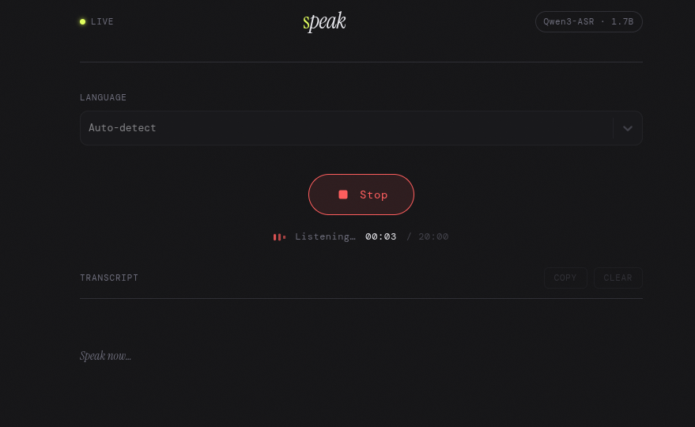

# Speech to Text

> Powered by Qwen3-ASR-1.7B



This repository provides a minimal local inference application that hosts a speech-to-text (ASR) model
locally and a small client for testing and development.

The server hosts a Hugging Face-compatible ASR model (example: Qwen3-ASR-1.7B) behind a simple HTTP
API. The client is a React + TypeScript Vite app that demonstrates uploading audio and displaying
transcriptions.

## Highlights

- Lightweight FastAPI server for local model inference (see [server/README.md](server/README.md)).
- React + TypeScript client scaffolded with Vite to demo recording/uploading audio (see [client/README.md](client/README.md)).
- Example audio files under `sample/` for quick testing.

## Repository structure

- `server/` — the inference server and model-loading code. See [server/README.md](server/README.md) for setup.
- `client/` — React frontend (Vite + TypeScript). See [client/README.md](client/README.md) for setup.

## Requirements

- Python 3.9+ (for the server)
- Node 16+ / npm or yarn (for the client)
- Git LFS (optional, if large model weights are stored outside the repo)

## Quick start

1. Read the server setup and start instructions:
   - See [server/README.md](server/README.md) for model configuration, environment variables, and how to run the API.
2. Start the client for a local demo:
   - See [client/README.md](client/README.md) for installing dependencies and running the Vite dev server.

Minimal API examples

- Health check:

    ```bash
    curl http://127.0.0.1:8000/health
    ```

- Transcribe a local WAV file (multipart form `file`):

    ```bash
    curl -v -F "file=@sample/harvard.wav" http://127.0.0.1:8000/transcribe
    ```

    Expected JSON response:

    ```json
    { "text": "...transcribed text..." }
    ```

## Development notes

- Loading a large model may take a while on first request while weights are initialized.
- If you have a GPU, install a matching `torch` build (with CUDA) for faster inference.
- Supported audio formats depend on `soundfile` and the model; use `ffmpeg` to convert if necessary:

    ```bash
    ffmpeg -i input.mp3 -ar 16000 -ac 1 output.wav
    ```
